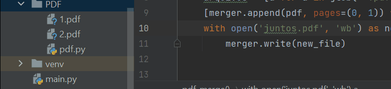

<h1 align="center">PDF Merger em Python</h1>

    <a href="#demo">Demo</a>
    <a href="#sobre">Sobre</a>
    <a href="#tecnologias">Tecnologias</a>
    <a href="#sobremim">Sobre mim</a>

---

     

## 🎞 Demo: 

    

     

---

     

## 💡 Sobre: 
Projeto desenvolvido para ajudar pessoas a juntarem PDF's.

     

---

     

## 💻 Tecnologias: 
<ul>
    <li>Python</li>
</ul>

     

---

     

## 👩‍💻 Sobre mim: 

    

        <a href="https://www.linkedin.com/in/ticianne-dias-a7a66b134/">Linkedin</a>
        <a href="https://ticiannedias.github.io/">Currículo online</a>
    

     

---